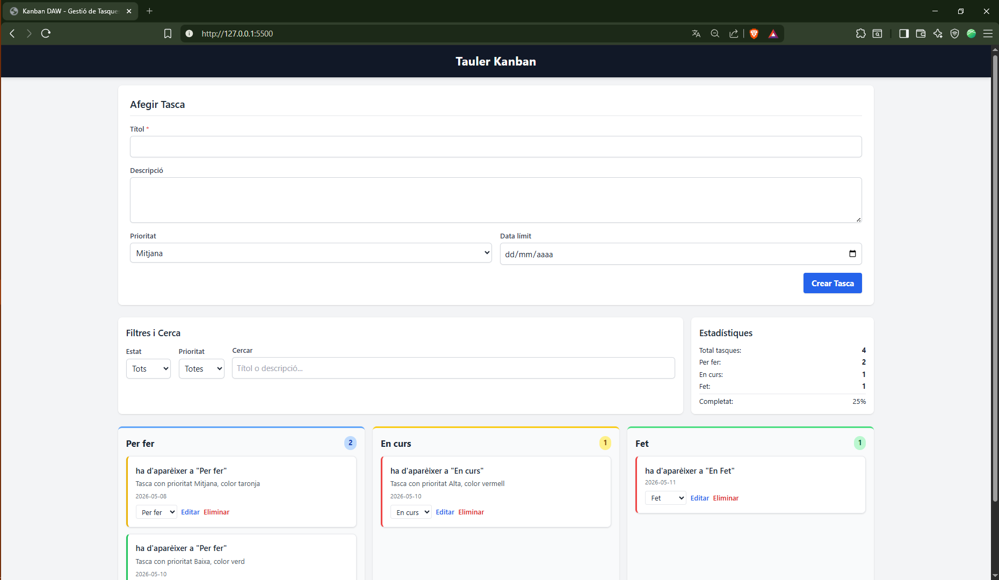
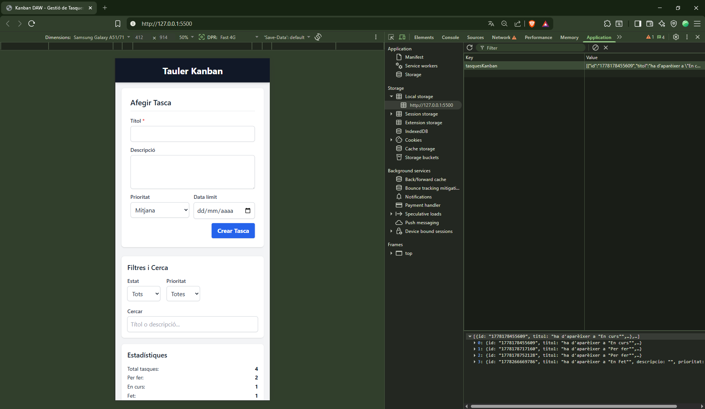

# Tauler Kanban - DAW06

Aquest repositori conté una aplicació web de tipus Kanban desenvolupada com a pràctica per a la unitat DAW06 (Desplegament d'Aplicacions Web).

## Enllaços (emplenar abans de lliurar)

Pots provar l'aplicació desplegada aquí:

- Repositori GitHub: `https://github.com/omarortegafp/kanban-daw`
- GitHub Pages (aplicació): `https://omarortegafp.github.io/kanban-daw`

## Funcionalitats principals

- **CRUD Complet**: Crear, editar i eliminar tasques.
- **Persistència**: Les dades es guarden automàticament al navegador (`localStorage`).
- **Organització Kanban**: Tres columnes d'estat (`Per fer`, `En curs`, `Fet`).
- **Filtres i Cerca**: Filtra per estat/prioritat i cerca per text en títol o descripció.
- **Estadístiques**: Comptadors totals i percentatge de completat en temps real.
- **Disseny Responsiu**: Adaptat per a mòbil i escriptori gràcies a Tailwind CSS.

## Fitxers i estructura clau

```
kanban-daw/
├── index.html        # Pàgina principal (entrada de l'app)
├── css/estils.css    # Estils addicionals
├── js/script.js     # Únic script que implementa CRUD, filtres i persistència
├── img/              # Captures i recursos gràfics
└── README.md         # Aquest fitxer
```

## Guia ràpida d'ús

1. **Crear una tasca**:
   - Omple el formulari superior (el títol és obligatori).
   - Selecciona prioritat i data límit (opcional).
   - Clica **"Afegir Tasca"**.

2. **Editar una tasca**:
   - Clica el botó **"Editar"** a la targeta corresponent.
   - El formulari s'omplirà amb les dades existents.
   - Modifica els camps i clica **"Guardar Canvis"**.

3. **Eliminar una tasca**:
   - Clica el botó **"Eliminar"** i confirma l'acció.

4. **Canviar l'estat**:
   - Utilitza el menú desplegable dins de cada targeta per moure-la entre columnes (`Per fer` → `En curs` → `Fet`).

5. **Filtrar i Cercar**:
   - Usa els selectors d'**Estat** i **Prioritat** per filtrar resultats.
   - Escriu al camp **Cercar** per trobar tasques per títol o descripció.

## Execució local

1. Clona el repositori o descarrega'l.
2. Obre el fitxer `index.html` directament amb un navegador modern (Chrome, Firefox, Edge).
3. L'aplicació carregarà les tasques des de `localStorage`. Si és la primera vegada, veuràs el tauler buit.

## Captures de pantalla

### Vista Escriptori



### Vista Mòbil (Responsive)



## Autor

Desenvolupat per **Omar Ortega Rodríguez** com a part del mòdul **DAW06**.
